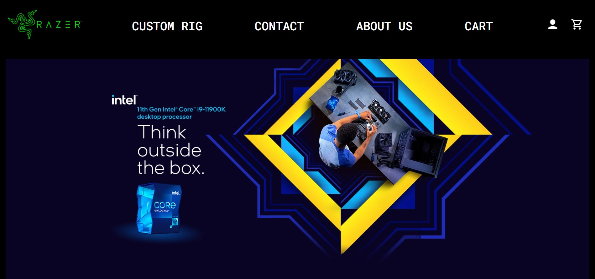
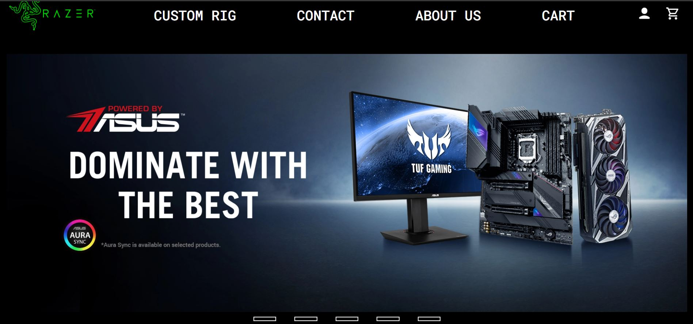
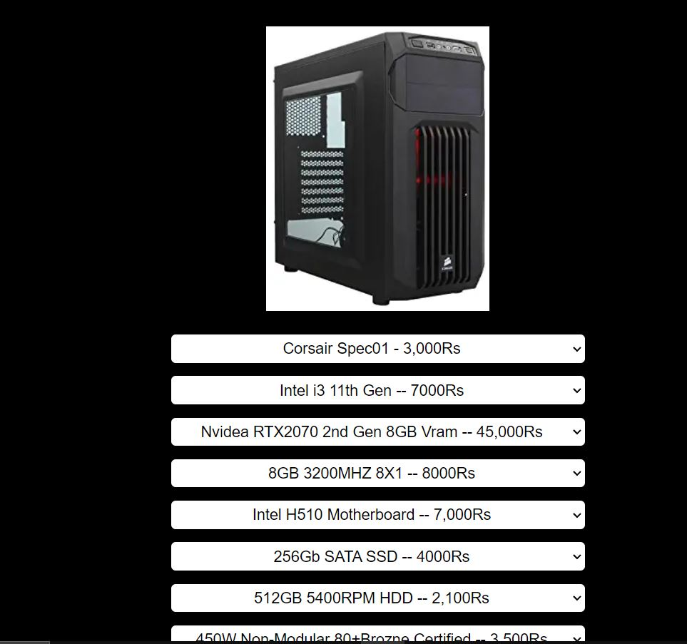
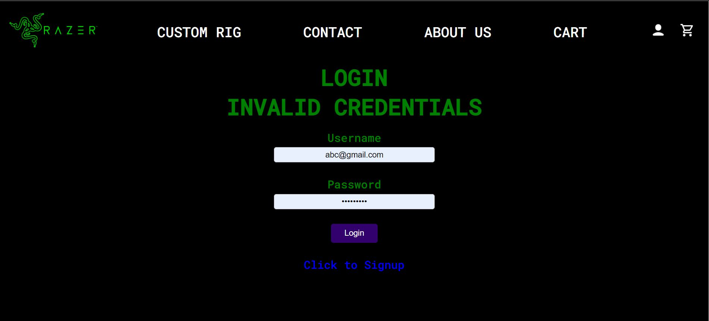

This is a PC Building Website where users can have a great experience creating custom pcs with parts of their choice.
We have used PHP and MySQL for most of the part and little bit of JavaScript for dynamic features

This is the home page where we have implemented a scrollable banners using checkbox

On this page we provide the user with multiple parts and options with prices

This is the login page where a user has entered invalid credentials
We implemented user authentication using PHP $\_SESSION variables.
Also in the database we stored the password in form of hashed string for security reasons
